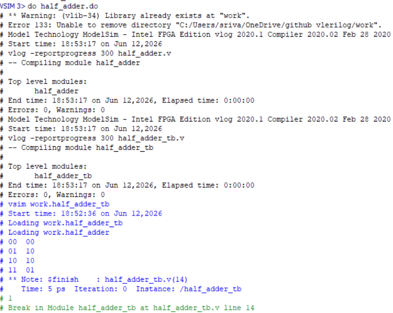

# Half Adder

## Description 
Half Adder implemented Using Verilog HDL

## Inputs
- A
- B

## Outputs
- Sum
- Carry

## Tools Used
Modelsim/Questasim

## Simulation Result

## Author 
Sri Vaishnavi Bougi
